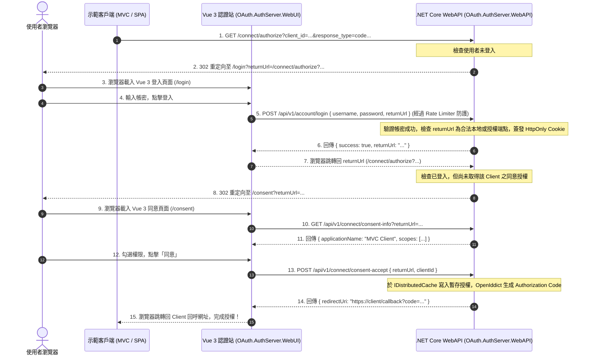

# 階段一實作計畫書：AuthServer 核心 Headless 改造與 Vue 3 認證站建置 (修訂版)

## Goal Description
將目前 [.NET Core 10 Web API](file:///mnt/d/lab/oauth/src/AuthServer/OAuth.AuthServer.WebAPI/) 中的 **Razor Pages（`Authorize.cshtml`、`Consent.cshtml`）徹底移除**，轉型為純粹的 **Headless OAuth Server**；並在同層目錄建立全新的純 Vue 3 前端專案 **`src/AuthServer/OAuth.AuthServer.WebUI`**，負責提供統一視覺與體驗的 **登入（/login）、授權同意（/consent）、註冊（/register）、錯誤提示（/error）** 四大核心視圖。

---

## 審查修正與重大資安強化點

> [!IMPORTANT]
> **防範 Open Redirect 釣魚攻擊**：
> 登入與同意頁面所有涉及 `returnUrl` 的端點，必須強制透過 `Url.IsLocalUrl()` 校驗，或僅允許符合已註冊 OpenIddict Client 的合法 Redirect URI，杜絕被構造釣魚網址跳轉至惡意站點。

> [!IMPORTANT]
> **登入暴力破解防護 (Rate Limiting)**：
> 在 `POST /api/v1/account/login` 端點掛載 ASP.NET Core `FixedWindowRateLimiter`，限制每個客戶端 IP 每分鐘最多嘗試 5 次，防止分散式字典檔碰撞。

> [!IMPORTANT]
> **多節點叢集相容 (Distributed Cache)**：
> Consent 流程的短期臨時權限憑證採用 `IDistributedCache`（開發環境 InMemory，生產環境支援 Redis），避免多 Pod 負載平衡時快取遺失導致授權循環。

> [!NOTE]
> **真實進度檢核**：
> 目前專案代碼庫處於未修改狀態，以下為正式待執行之實作清單。

---

## 待執行工作清單 (Execution Checklist)

- [ ] **1. 後端 Razor Pages 徹底拔除**：刪除 `Pages/` 目錄。
- [ ] **2. 後端 SPA 靜態託管配置**：於 `Program.cs` 註冊 `UseDefaultFiles()`、`UseStaticFiles()`、`MapFallbackToFile("index.html")`。
- [ ] **3. 註冊速率限制器 (Rate Limiter)**：於 `Program.cs` 註冊防暴力破解原則。
- [ ] **4. 實作 Headless Consent API (`Connect/ConsentApiController.cs`)**：
  - `GET /api/v1/connect/consent-info`（讀取 Client 名稱與 Scope，驗證 returnUrl 安全性）。
  - `POST /api/v1/connect/consent-accept`（寫入 DistributedCache 並回傳授權跳轉網址）。
  - `POST /api/v1/connect/consent-deny`。
- [ ] **5. 擴充帳號 API (`Account/AccountApiController.cs`)**：
  - `POST /api/v1/account/login`（掛載 Rate Limiter，支援 Username/Email，安全跳轉）。
  - `POST /api/v1/account/logout`。
  - `GET /api/v1/account/me`。
- [ ] **6. 更新 `Connect/AuthorizationController.cs`**：
  - 授權導航路徑切換為 `/login?returnUrl=...` 與 `/consent?returnUrl=...`。
- [ ] **7. 建立前端專案 (`src/AuthServer/OAuth.AuthServer.WebUI`)**：
  - Vue 3 + Vite + TypeScript 專案初始化。
  - 實作 `LoginView`、`ConsentView`、`RegisterView`、`ErrorView`。
  - 路由別名同時相容 `/login` & `/Account/Login`、`/consent` & `/Connect/Consent`。
  - 保留 Playwright 測試所需的 DOM 元素屬性（`input[name='userName']`、`[data-testid='scope-list']`、`button[value='accept']`）。
- [ ] **8. 建置與驗證**：編譯前端至 `WebAPI/wwwroot`，執行後端整合測試與手動登入跳轉驗證。

---

## 循序流程圖：Headless 授權碼與同意流程



---

## 核心 API 設計細節

### `ConsentApiController.cs` (安全防護增強)
```csharp
[ApiController]
[Route("api/v1/connect")]
[Authorize]
public class ConsentApiController(
    IOpenIddictApplicationManager appManager,
    IDistributedCache cache) : ControllerBase
{
    [HttpGet("consent-info")]
    public async Task<IActionResult> GetConsentInfo([FromQuery] string returnUrl)
    {
        // 1. 嚴格防範 Open Redirect
        if (string.IsNullOrWhiteSpace(returnUrl) || (!Url.IsLocalUrl(returnUrl) && !returnUrl.StartsWith("/connect/authorize")))
            return BadRequest(new { message = "無效或非法的 returnUrl" });

        var query = QueryHelpers.ParseQuery(new Uri("https://localhost" + returnUrl).Query);
        var clientId = query["client_id"].ToString();
        var scope = query["scope"].ToString();

        var app = await appManager.FindByClientIdAsync(clientId);
        if (app is null)
            return BadRequest(new { message = "找不到對應的第三方應用程式" });

        return Ok(new
        {
            clientId,
            clientDisplayName = await appManager.GetDisplayNameAsync(app) ?? clientId,
            scopes = scope.Split(' ', StringSplitOptions.RemoveEmptyEntries),
            returnUrl
        });
    }

    [HttpPost("consent-accept")]
    public async Task<IActionResult> Accept([FromBody] ConsentDecisionRequest request)
    {
        if (!Url.IsLocalUrl(request.ReturnUrl) && !request.ReturnUrl.StartsWith("/connect/authorize"))
            return BadRequest(new { message = "非法跳轉目標" });

        var token = Guid.NewGuid().ToString("N");
        // 寫入 Distributed Cache，有效期限 60 秒
        await cache.SetStringAsync($"consent:{token}", $"granted:{request.ClientId}", 
            new DistributedCacheEntryOptions { AbsoluteExpirationRelativeToNow = TimeSpan.FromSeconds(60) });

        var separator = request.ReturnUrl.Contains('?') ? "&" : "?";
        return Ok(new { redirectUrl = $"{request.ReturnUrl}{separator}__ct={token}" });
    }
}
```

---

## 驗證計畫

1. **整合測試**：
   - 執行 `dotnet test test/OAuth.AuthServer.IntegrationTest`。
2. **端到端流程驗證**：
   - MVC Client 發起登入 -> 跳轉至 Vue 3 `/login` -> 登入成功 -> 跳轉至 Vue 3 `/consent` -> 點擊同意 -> 順利返回 MVC Client。
