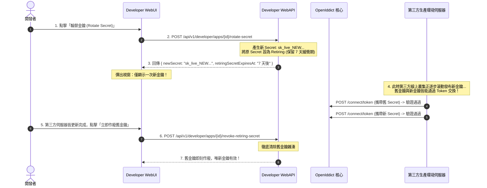

# 階段三詳細計畫書：第三方開發者平台 (Developer Portal) - 修訂版

## Goal Description
建置業務需求模組 **`src/Developer/`**，包含專屬後端 **`OAuth.Developer.WebAPI`** 與前端 **`OAuth.Developer.WebUI`**（Vue 3 SPA）。
提供第三方軟體工程師一站式的開發者工作台，涵蓋開發者身分啟用、應用程式生命週期管理（Web / SPA / Mobile App）、**具備過渡緩衝期的零停機金鑰輪替機制（Zero-Downtime Secret Rotation）**、全客戶端 PKCE 強制防護、Redirect URI 設定、沙盒測試工具以及上線審批提交流程。

---

## 審查修正重點

> [!IMPORTANT]
> **零停機雙金鑰輪替機制 (Dual-Secret with Grace Period)**：
> 審查報告嚴正指出：若輪替時舊 Secret 立即失效，生產環境線上多台伺服器瞬間全斷線！
> 本計畫導入業界標準（如 GitHub、Stripe）：
> 1. 當開發者申請輪替時，系統生成 **新金鑰 (Active Secret)**。
> 2. 原金鑰降級為 **過渡金鑰 (Retiring Secret)**，允許並行驗證 **7 天**（或由開發者在線上更換完畢後手動點擊「立即廢止舊金鑰」）。
> 3. 保障線上生產環境零停機平滑換密。

> [!IMPORTANT]
> **全面強制 PKCE (RFC 9700 OAuth 2.0 Security BCP)**：
> 不僅限於 Mobile 與 SPA，對於擁有 Secret 的機密型 Web 客戶端，亦預設/強制啟用 PKCE，杜絕授權碼攔截與授權碼注入攻擊（Authorization Code Injection）。

---

## 目錄結構與架構邊界

```
src/Developer/
├── OAuth.Developer.WebAPI/                   # 後端專用 API (Bearer 認證)
│   ├── Controllers/
│   │   ├── DeveloperAccountController.cs     # 啟用開發者身分 API
│   │   ├── ApplicationsController.cs         # App 增刪查改、Redirect URI 設定
│   │   ├── CredentialsController.cs          # ★ 雙金鑰輪替 (Dual-Secret) 與單次顯示
│   │   └── ReviewSubmissionController.cs     # 送出上線審核 API
│   ├── Services/
│   │   └── SecretRotationManager.cs          # 雙金鑰生成、雜湊比對與自動過期
│   ├── Program.cs
│   └── OAuth.Developer.WebAPI.csproj
│
└── OAuth.Developer.WebUI/                    # 前端 Vue 3 + Vite SPA (PKCE 認證，developer.domain.com)
    ├── package.json
    ├── vite.config.ts
    ├── src/
    │   ├── auth/oidc.ts                      # OIDC PKCE Client
    │   ├── api/developer.ts
    │   ├── router/index.ts
    │   └── views/
    │       ├── DeveloperRegisterView.vue     # 啟用開發者身分
    │       ├── AppListView.vue               # 我的應用程式列表 (Sandbox / InReview / Approved)
    │       ├── AppCreateView.vue             # 建立 App (Web / SPA / Mobile)
    │       ├── AppDetailView.vue             # App 設定 (Redirect URIs、Scopes、Logo)
    │       ├── KeyManagementView.vue         # ★ 金鑰管理 (顯示新舊金鑰狀態、倒數計時、廢止按鈕)
    │       └── SandboxTestView.vue           # 沙盒除錯工具 (自動生成測試授權網址)
    └── index.html
```

---

## 雙金鑰輪替 (Dual-Secret Rotation) 運作流程



---

## 核心 API 介面規格

### 1. 建立應用程式 (`ApplicationsController.cs`)
- `POST /api/v1/developer/apps`
- **全類型強制要求 PKCE**：
  ```csharp
  // 無論 Web、SPA 還是 Mobile，均註冊 PKCE 要求
  descriptor.Permissions.Add(Permissions.Endpoints.Authorization);
  descriptor.Permissions.Add(Permissions.Endpoints.Token);
  descriptor.Permissions.Add(Permissions.GrantTypes.AuthorizationCode);
  descriptor.Permissions.Add(Permissions.ResponseTypes.Code);
  descriptor.Requirements.Add(Requirements.Features.ProofKeyForCodeExchange); // 強制 PKCE
  ```

### 2. 金鑰輪替管理 (`CredentialsController.cs`)

#### [POST] `/api/v1/developer/apps/{id}/rotate-secret`
- 產生新 Client Secret，將目前有效 Secret 標記為 `Retiring`（設定 `RetiringExpiresAt = UtcNow.AddDays(7)`）。
- 回傳新明文 Secret（僅本次回傳）。

#### [POST] `/api/v1/developer/apps/{id}/revoke-retiring-secret`
- 開發者確認線上服務更新完畢後，手動提前終止舊金鑰。

---

## 前端視圖與互動體驗設計 (`OAuth.Developer.WebUI`)

### `KeyManagementView.vue`
- **主要金鑰區塊**：
  - 顯示 Client ID（附帶複製按鈕）。
  - 當前有效金鑰：`sk_live_••••••••••••••••`（不可再次檢視明文）。
  - 按鈕：「**輪替金鑰 (Rotate Secret)**」。
- **過渡緩衝金鑰區塊 (若存在輪替中金鑰)**：
  - 醒目黃色警示卡片：「⚠️ 舊金鑰目前仍處於過渡相容期，將於 5 天 12 小時後自動失效」。
  - 提供按鈕：「**已完成伺服器更新，立即廢止舊金鑰**」。

---

## 驗證計畫

1. **整合測試 (BDD)**：
   - 建立機密型客戶端並取得初始 Secret。
   - 觸發輪替，取得新 Secret。
   - 驗證「使用新 Secret」能成功取得 Token。
   - 驗證在 7 天緩衝期內「使用舊 Secret」亦能成功取得 Token（零停機保證）。
   - 觸發手動廢止舊金鑰。
   - 驗證「使用舊 Secret」立即收到 `invalid_client` 失敗。
