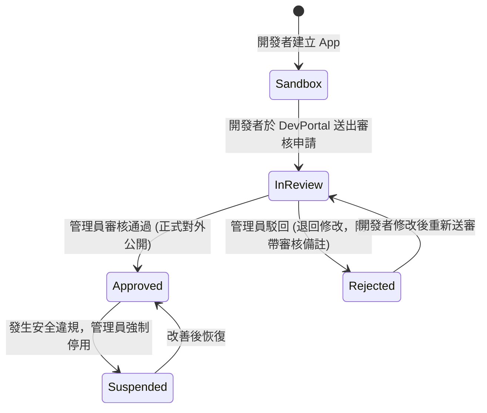

# 階段四詳細計畫書：OAuth 管理員後台 (Admin Portal)

## Goal Description
建置業務需求模組 **`src/Admin/`**，包含專屬後端 **`OAuth.Admin.WebAPI`** 與前端 **`OAuth.Admin.WebUI`**（Vue 3 SPA），**正式除役並取代舊有的 Blazor Server 專案**。
提供內部最高維運人員與資安主管專屬的營運儀表板，涵蓋**第三方應用程式上線審批**、敏感 Scope 申請審核、全域 Scope 定義、**全站使用者帳號管理（凍結、解鎖、角色授權）**、以及即時授權審計日誌。

---

## 目錄結構與架構邊界

```
src/Admin/
├── OAuth.Admin.WebAPI/                       # 後端專用管理 API (受最高 Admin 權限保護)
│   ├── Controllers/
│   │   ├── AppReviewController.cs            # ★ 第三方 App 審核流 (待審核、核准、駁回)
│   │   ├── UserManageController.cs           # 使用者凍結、解鎖、重設 2FA、角色維護
│   │   ├── ScopeManageController.cs          # 全域 Scope 建立、編輯、標記是否為敏感權限
│   │   └── AuditLogController.cs             # 授權事件日誌查詢
│   ├── Program.cs                            # 限制僅有 "Administrator" 角色的 Session Cookie 存取
│   └── OAuth.Admin.WebAPI.csproj
│
└── OAuth.Admin.WebUI/                        # 前端 Vue 3 + Vite SPA (部署在 admin.domain.com，建議限內網)
    ├── package.json
    ├── vite.config.ts
    ├── src/
    │   ├── api/admin.ts
    │   ├── router/index.ts
    │   └── views/
    │       ├── ReviewDashboardView.vue       # ★ 第三方 App 審批工作台 (申請理由、要求 Scope 核准)
    │       ├── AppDirectoryView.vue          # 全域應用程式清單 (狀態篩選、強制停用/啟用)
    │       ├── UserDirectoryView.vue         # 使用者清單 (帳號鎖定、角色設定、強制登出)
    │       ├── ScopeDirectoryView.vue        # Scope 矩陣設定 (設定一般 Scope 與敏感 Scope)
    │       └── AuditLogsView.vue             # 授權審計日誌 (登入失敗、Token 核發、金鑰輪替事件)
    └── index.html
```

---

## 核心審批業務流程（Approval Workflow）

第三方應用程式從開發到公開上線的生命週期由本後台嚴密控管：



---

## 核心 API 介面規格

### 1. 應用程式審批 (`AppReviewController.cs`)

#### [GET] `/api/v1/admin/apps/pending`
取得所有待審核的應用程式清單（附帶開發者資訊、要求的 Redirect URIs 與申請的 Scopes）。

#### [POST] `/api/v1/admin/apps/{id}/approve`
- 將該 App 的狀態更新為 `Approved`。
- 開啟對全站所有使用者的授權許可。

#### [POST] `/api/v1/admin/apps/{id}/reject`
- Body: `{ "reason": "Redirect URI 不符合 HTTPS 規範，請修正後重新送審" }`。
- 將狀態更新為 `Rejected` 並記錄審核意見，開發者登入開發者後台即可檢視原因。

#### [POST] `/api/v1/admin/apps/{id}/suspend`
- 緊急強制停用違規 App，**後端同步吊銷該 Client 底下的所有流通 Token**。

---

### 2. 使用者狀態管理 (`UserManageController.cs`)

#### [PUT] `/api/v1/admin/users/{id}/lockout`
- 將特定違規用戶設定 `LockoutEnd = DateTime.UtcNow.AddYears(100)`，強制凍結該帳號，無法再登入任何系統。

#### [PUT] `/api/v1/admin/users/{id}/unlock`
- 解除帳號鎖定。

#### [POST] `/api/v1/admin/users/{id}/revoke-sessions`
- 強制登出該用戶的所有已連線工作階段（清除 SecurityStamp）。

---

## 既有 Blazor 專案除役與平滑遷移方案

目前專案中存在以 Blazor Server 打造的 `src/Admin/OAuth.Admin.WebUI`（使用 MudBlazor）。
當本階段之 Vue 3 `OAuth.Admin.WebUI` 建置完成並驗證通過後：
1. **封存舊 Blazor 程式碼**：將舊專案移至 `.archive/OAuth.Admin.WebUI.blazor/`（保留歷史參考）。
2. **零停機切換**：以全新 Vue 3 SPA 接手管理工作，全系統達成「100% 純 Vue 3」的前端技術棧純粹性。
