# OAuth2 + OIDC 授權流程、系統交互與狀態機架構設計文件

本文件記錄了本專案中核心 OAuth2 / OIDC 授權流程、帳號安全、授權同意、開發者平台、後台管理之循序圖（Sequence Diagrams），以及 Token、應用程式審核、金鑰輪替與憑證之狀態機（State Diagrams）。

---

## 目錄 (Table of Contents)

- [1. 核心 OAuth2 / OIDC 授權流程循序圖](#1-核心-oauth2--oidc-授權流程循序圖)
  - [1.1 Authorization Code Flow + PKCE (本地登入與 Headless 同意畫面)](#11-authorization-code-flow--pkce-本地登入與-headless-同意畫面)
  - [1.2 Social Login (Google 等) 聯邦綁定與登入流程](#12-social-login-google-等-聯邦綁定與登入流程)
  - [1.3 Client Credentials Flow (服務對服務)](#13-client-credentials-flow-服務對服務)
  - [1.4 Permanent Authorization (永久授權略過同意畫面)](#14-permanent-authorization-永久授權略過同意畫面)
- [2. 帳號安全與授權管理循序圖](#2-帳號安全與授權管理循序圖)
  - [2.1 會員註冊流程](#21-會員註冊流程)
  - [2.2 帳號安全與 2FA (TOTP) 管理](#22-帳號安全與-2fa-totp-管理)
  - [2.3 授權管理與級聯撤銷 (Cascading Revocation)](#23-授權管理與級聯撤銷-cascading-revocation)
- [3. 開發者平台與金鑰管理循序圖](#3-開發者平台與金鑰管理循序圖)
  - [3.1 第三方應用程式註冊與審核送審](#31-第三方應用程式註冊與審核送審)
  - [3.2 雙金鑰輪替零停機過渡機制 (Dual-Secret Rotation)](#32-雙金鑰輪替零停機過渡機制-dual-secret-rotation)
- [4. 管理員治理與後台管理循序圖](#4-管理員治理與後台管理循序圖)
  - [4.1 第三方應用審核與強制停用級聯吊銷](#41-第三方應用審核與強制停用級聯吊銷)
  - [4.2 使用者狀態管理 (凍結、解凍與強制登出)](#42-使用者狀態管理-凍結解凍與強制登出)
  - [4.3 角色管理與 OIDC Roles Claim 發放](#43-角色管理與-oidc-roles-claim-發放)
- [5. 核心狀態機 (State Diagrams)](#5-核心狀態機-state-diagrams)
  - [5.1 OIDC Token 狀態機 (Auth Code, Access Token, Refresh Token Rotation)](#51-oidc-token-狀態機-auth-code-access-token-refresh-token-rotation)
  - [5.2 第三方應用程式審核生命週期狀態機](#52-第三方應用程式審核生命週期狀態機)
  - [5.3 開發者雙金鑰生命週期狀態機](#53-開發者雙金鑰生命週期狀態機)
  - [5.4 開發與測試環境憑證安全狀態機](#54-開發與測試環境憑證安全狀態機)

---

## 1. 核心 OAuth2 / OIDC 授權流程循序圖

### 1.1 Authorization Code Flow + PKCE (本地登入與 Headless 同意畫面)

> **原始碼依據**：
> - 授權端點：[`src/AuthServer/OAuth.AuthServer.WebAPI/Connect/AuthorizationController.cs:24-145`](../../src/AuthServer/OAuth.AuthServer.WebAPI/Connect/AuthorizationController.cs#L24-L145)
> - 登入端點：[`src/AuthServer/OAuth.AuthServer.WebAPI/Account/AccountApiController.cs:44-76`](../../src/AuthServer/OAuth.AuthServer.WebAPI/Account/AccountApiController.cs#L44-L76)
> - 同意端點：[`src/AuthServer/OAuth.AuthServer.WebAPI/Connect/ConsentApiController.cs:26-75`](../../src/AuthServer/OAuth.AuthServer.WebAPI/Connect/ConsentApiController.cs#L26-L75)
> - Token 端點：[`src/AuthServer/OAuth.AuthServer.WebAPI/Connect/TokenController.cs:19-77`](../../src/AuthServer/OAuth.AuthServer.WebAPI/Connect/TokenController.cs#L19-L77)
> - 測試案例：[`test/OAuth.AuthServer.IntegrationTest/_04_Consent/授權同意API.feature`](../../test/OAuth.AuthServer.IntegrationTest/_04_Consent/%E6%8E%88%E6%AC%8A%E5%90%8C%E6%84%8FAPI.feature)

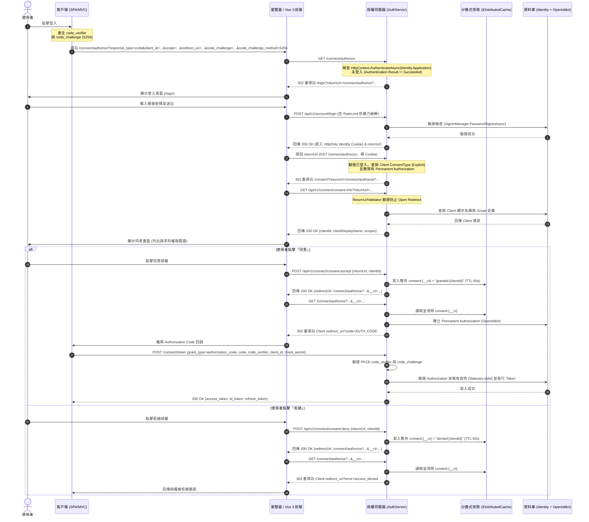

---

### 1.2 Social Login (Google 等) 聯邦綁定與登入流程

> **原始碼依據**：[`src/AuthServer/OAuth.AuthServer.WebAPI/Connect/ExternalLoginController.cs:18-85`](../../src/AuthServer/OAuth.AuthServer.WebAPI/Connect/ExternalLoginController.cs#L18-L85)

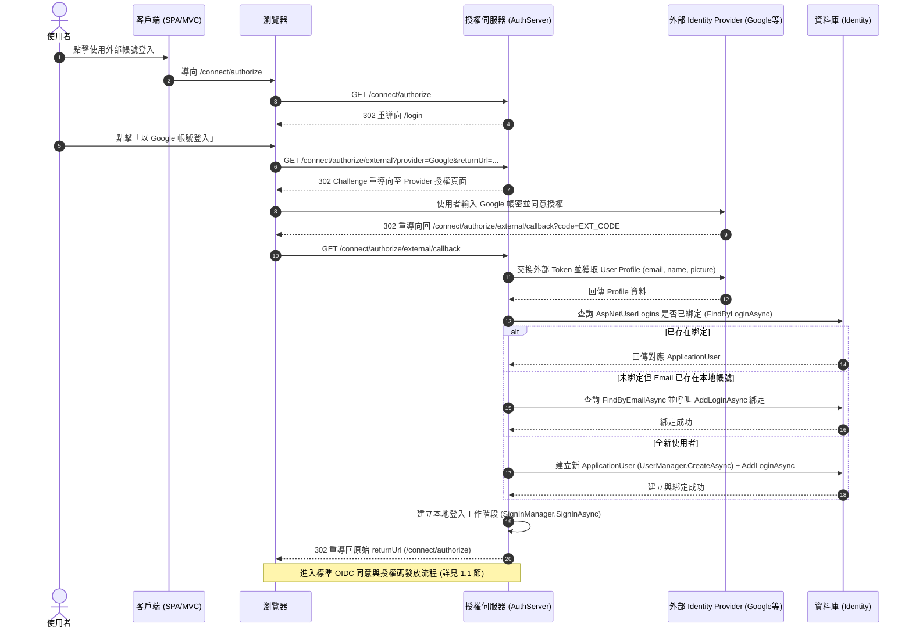

---

### 1.3 Client Credentials Flow (服務對服務)

> **原始碼依據**：[`src/AuthServer/OAuth.AuthServer.WebAPI/Connect/TokenController.cs:79-85`](../../src/AuthServer/OAuth.AuthServer.WebAPI/Connect/TokenController.cs#L79-L85)

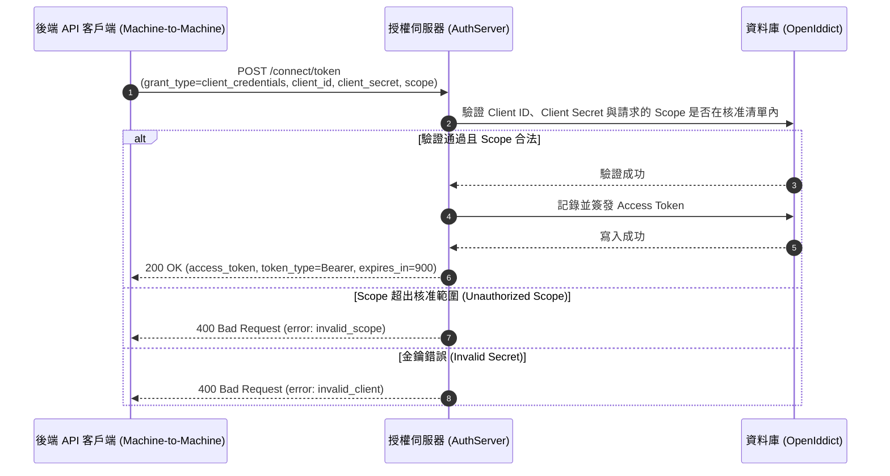

---

### 1.4 Permanent Authorization (永久授權略過同意畫面)

> **原始碼依據**：
> - [`src/AuthServer/OAuth.AuthServer.WebAPI/Connect/AuthorizationController.cs:44-56, 96-101`](../../src/AuthServer/OAuth.AuthServer.WebAPI/Connect/AuthorizationController.cs#L44-L56)
> - 測試案例：[`test/OAuth.AuthServer.IntegrationTest/_06_RealWorldScenarios/跨模組真實場景.feature:267-314`](../../test/OAuth.AuthServer.IntegrationTest/_06_RealWorldScenarios/%E8%B7%A8%E6%A8%A1%E7%B5%84%E7%9C%9F%E5%AF%A6%E5%A0%B4%E6%99%AF.feature#L267-L314)

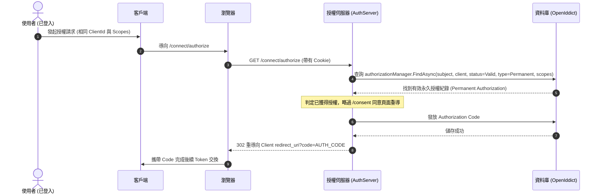

---

## 2. 帳號安全與授權管理循序圖

### 2.1 會員註冊流程

> **原始碼依據**：
> - 控制器：[`src/AuthServer/OAuth.AuthServer.WebAPI/Account/AccountApiController.cs:19-38`](../../src/AuthServer/OAuth.AuthServer.WebAPI/Account/AccountApiController.cs#L19-L38)
> - 測試案例：[`test/OAuth.AuthServer.IntegrationTest/_01_Account/帳號註冊.feature`](../../test/OAuth.AuthServer.IntegrationTest/_01_Account/%E5%B8%B3%E8%99%9F%E8%A8%BB%E5%86%8A.feature)

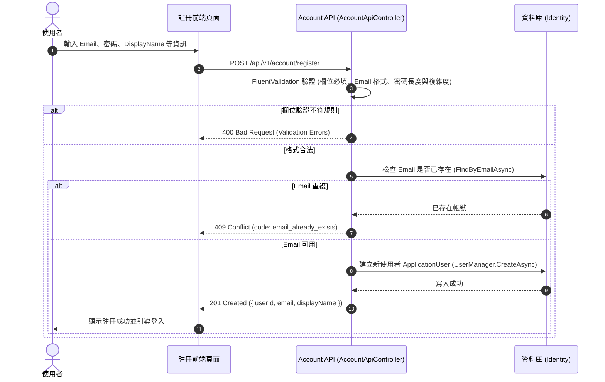

---

### 2.2 帳號安全與 2FA (TOTP) 管理

> **原始碼依據**：
> - 控制器：[`src/Account/OAuth.Account.WebAPI/Controllers/SecurityController.cs`](../../src/Account/OAuth.Account.WebAPI/Controllers/SecurityController.cs)
> - 測試案例：[`src/Account/OAuth.Account.Tests/_02_Security/帳號安全與2FA.feature`](../../src/Account/OAuth.Account.Tests/_02_Security/%E5%B8%B3%E8%99%9F%E5%AE%89%E5%85%A8%E8%88%872FA.feature)

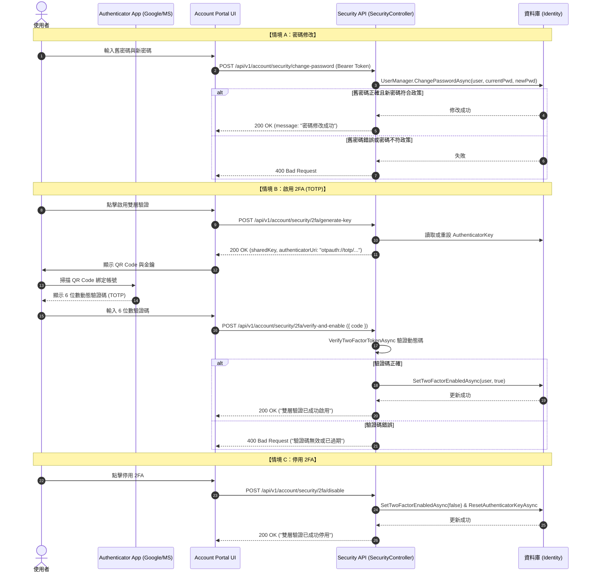

---

### 2.3 授權管理與級聯撤銷 (Cascading Revocation)

> **原始碼依據**：
> - 控制器：[`src/Account/OAuth.Account.WebAPI/Controllers/ConsentsController.cs:18-87`](../../src/Account/OAuth.Account.WebAPI/Controllers/ConsentsController.cs#L18-L87)
> - 測試案例：[`src/Account/OAuth.Account.Tests/_03_Consents/授權管理與級聯撤銷.feature`](../../src/Account/OAuth.Account.Tests/_03_Consents/%E6%8E%88%E6%AC%8A%E7%AE%A1%E7%90%86%E8%88%87%E7%B4%9A%E8%81%AF%E6%92%A4%E9%8A%B7.feature)

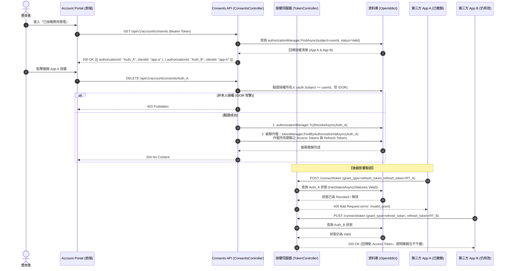

---

## 3. 開發者平台與金鑰管理循序圖

### 3.1 第三方應用程式註冊與審核送審

> **原始碼依據**：
> - 應用註冊：[`src/Developer/OAuth.Developer.WebAPI/Controllers/ApplicationsController.cs`](../../src/Developer/OAuth.Developer.WebAPI/Controllers/ApplicationsController.cs)
> - 審核送審：[`src/Developer/OAuth.Developer.WebAPI/Controllers/ReviewSubmissionController.cs`](../../src/Developer/OAuth.Developer.WebAPI/Controllers/ReviewSubmissionController.cs)
> - 測試案例：[`test/OAuth.AuthServer.IntegrationTest/_06_RealWorldScenarios/跨模組真實場景.feature:38-68`](../../test/OAuth.AuthServer.IntegrationTest/_06_RealWorldScenarios/%E8%B7%A8%E6%A8%A1%E7%B5%84%E7%9C%9F%E5%AF%A6%E5%A0%B4%E6%99%AF.feature#L38-L68)

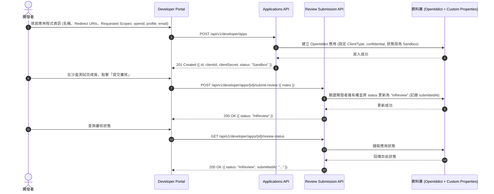

---

### 3.2 雙金鑰輪替零停機過渡機制 (Dual-Secret Rotation)

> **原始碼依據**：
> - 控制器：[`src/Developer/OAuth.Developer.WebAPI/Controllers/CredentialsController.cs:34-80`](../../src/Developer/OAuth.Developer.WebAPI/Controllers/CredentialsController.cs#L34-L80)
> - 服務層：[`src/Developer/OAuth.Developer.WebAPI/Services/SecretRotationManager.cs`](../../src/Developer/OAuth.Developer.WebAPI/Services/SecretRotationManager.cs)
> - 測試案例：[`src/Developer/OAuth.Developer.Tests/_02_SecretRotation/雙金鑰輪替.feature`](../../src/Developer/OAuth.Developer.Tests/_02_SecretRotation/%E9%9B%99%E9%87%91%E9%91%B0%E8%BC%AA%E6%9B%BF.feature)

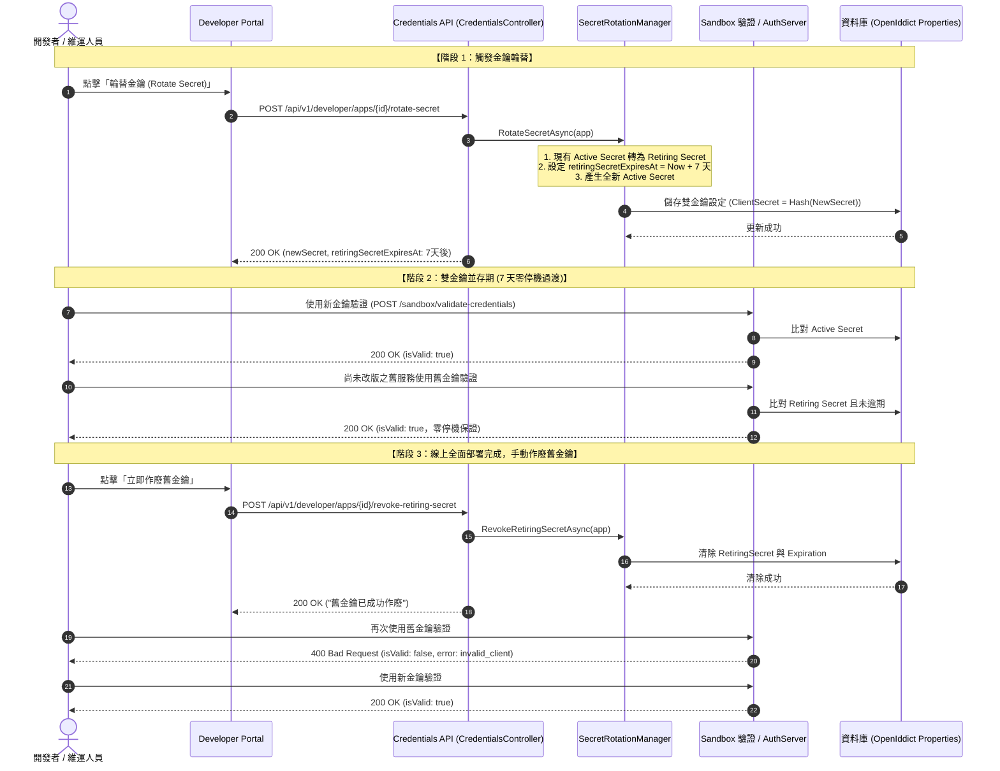

---

## 4. 管理員治理與後台管理循序圖

### 4.1 第三方應用審核與強制停用級聯吊銷

> **原始碼依據**：
> - 控制器：[`src/Admin/OAuth.Admin.WebAPI/Controllers/AppReviewController.cs:21-214`](../../src/Admin/OAuth.Admin.WebAPI/Controllers/AppReviewController.cs#L21-L214)
> - 測試案例：[`src/Admin/OAuth.Admin.WebAPI.IntegrationTest/_01_AppReview/第三方應用審核流.feature`](../../src/Admin/OAuth.Admin.WebAPI.IntegrationTest/_01_AppReview/%E7%AC%AC%E4%B8%89%E6%96%B9%E6%87%89%E7%94%A8%E5%AF%A9%E6%A0%B8%E6%B5%81.feature)

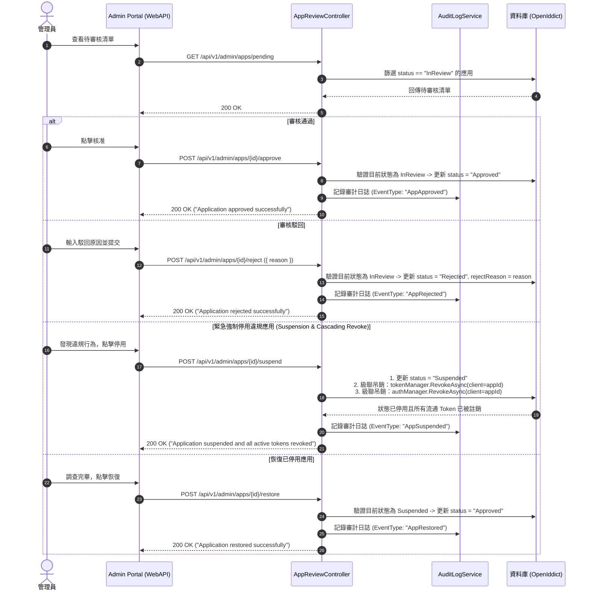

---

### 4.2 使用者狀態管理 (凍結、解凍與強制登出)

> **原始碼依據**：
> - 控制器：[`src/Admin/OAuth.Admin.WebAPI/Controllers/UserManageController.cs:74-134`](../../src/Admin/OAuth.Admin.WebAPI/Controllers/UserManageController.cs#L74-L134)
> - 測試案例：[`src/Admin/OAuth.Admin.WebAPI.IntegrationTest/_02_UserManage/使用者狀態管理.feature`](../../src/Admin/OAuth.Admin.WebAPI.IntegrationTest/_02_UserManage/%E4%BD%BF%E7%94%A8%E8%80%85%E7%8B%80%E6%85%8B%E7%AE%A1%E7%90%86.feature)

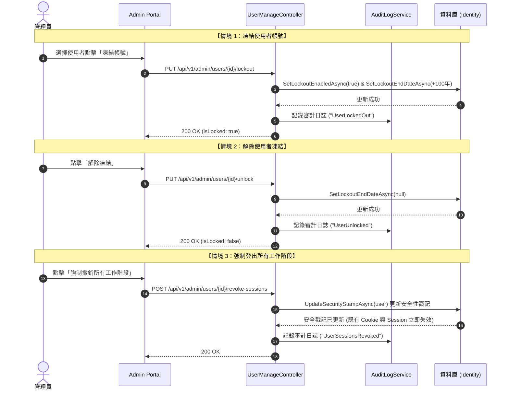

---

### 4.3 角色管理與 OIDC Roles Claim 發放

> **原始碼依據**：
> - 角色管理：[`src/Admin/OAuth.Admin.WebAPI/Controllers/RoleManageController.cs:16-104`](../../src/Admin/OAuth.Admin.WebAPI/Controllers/RoleManageController.cs#L16-L104)
> - 用戶角色：[`src/Admin/OAuth.Admin.WebAPI/Controllers/UserManageController.cs:136-165`](../../src/Admin/OAuth.Admin.WebAPI/Controllers/UserManageController.cs#L136-L165)
> - Token 發放：[`src/AuthServer/OAuth.AuthServer.WebAPI/Connect/TokenController.cs:67-73`](../../src/AuthServer/OAuth.AuthServer.WebAPI/Connect/TokenController.cs#L67-L73)
> - 測試案例：[`src/Admin/OAuth.Admin.WebAPI.IntegrationTest/_04_RoleManage/角色管理.feature`](../../src/Admin/OAuth.Admin.WebAPI.IntegrationTest/_04_RoleManage/%E8%A7%92%E8%89%B2%E7%AE%A1%E7%90%86.feature)

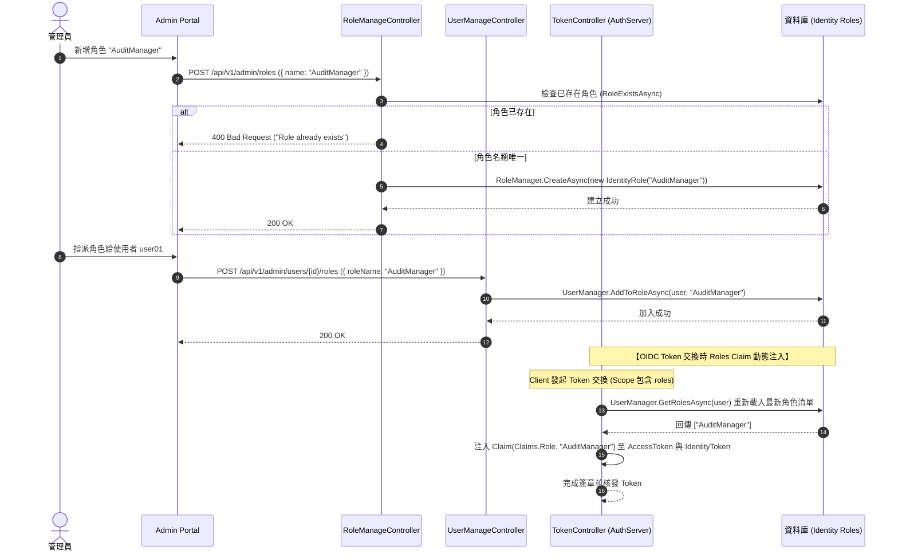

---

## 5. 核心狀態機 (State Diagrams)

### 5.1 OIDC Token 狀態機 (Auth Code, Access Token, Refresh Token Rotation)

> 本專案基於 OpenIddict 實作，其 Token 生產、使用與輪替之狀態轉換如下：

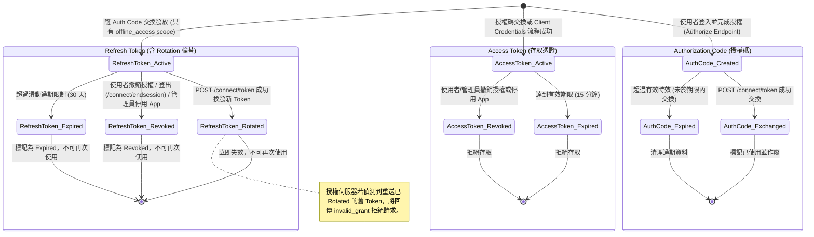

---

### 5.2 第三方應用程式審核生命週期狀態機

> **原始碼依據**：[`src/Admin/OAuth.Admin.WebAPI/Controllers/AppReviewController.cs`](../../src/Admin/OAuth.Admin.WebAPI/Controllers/AppReviewController.cs) 與 [`src/Developer/OAuth.Developer.WebAPI/Controllers/ReviewSubmissionController.cs`](../../src/Developer/OAuth.Developer.WebAPI/Controllers/ReviewSubmissionController.cs)

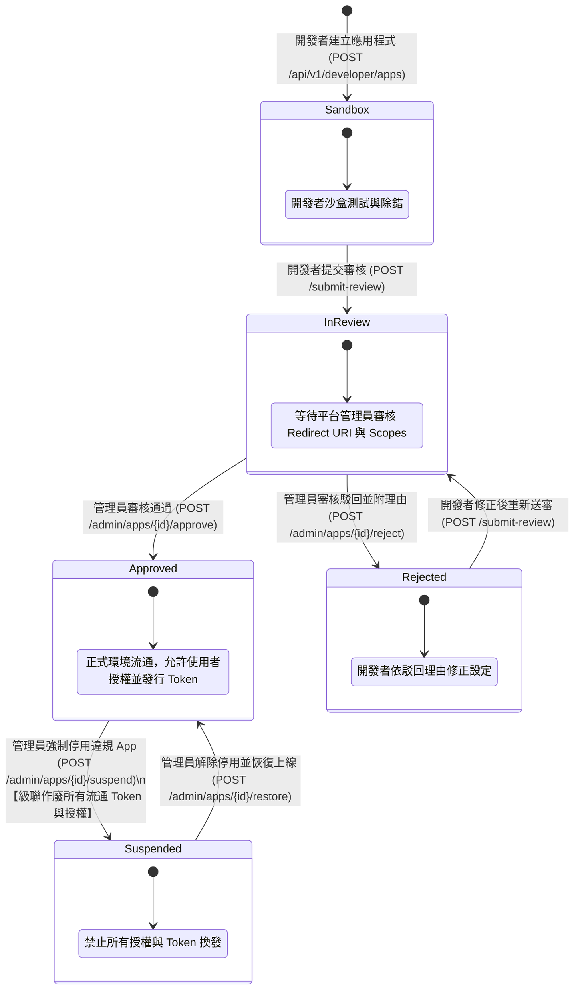

---

### 5.3 開發者雙金鑰生命週期狀態機

> **原始碼依據**：[`src/Developer/OAuth.Developer.WebAPI/Services/SecretRotationManager.cs`](../../src/Developer/OAuth.Developer.WebAPI/Services/SecretRotationManager.cs)

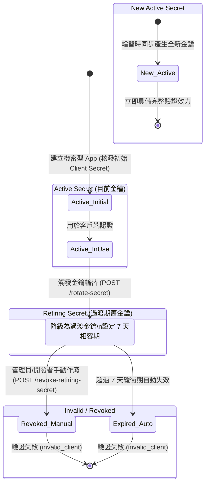

---

### 5.4 開發與測試環境憑證安全狀態機

> 為確保憑證安全性，避免 API 金鑰與個人 Token 落地外洩，本專案依循 DevOps 憑證安全規範管理如下：

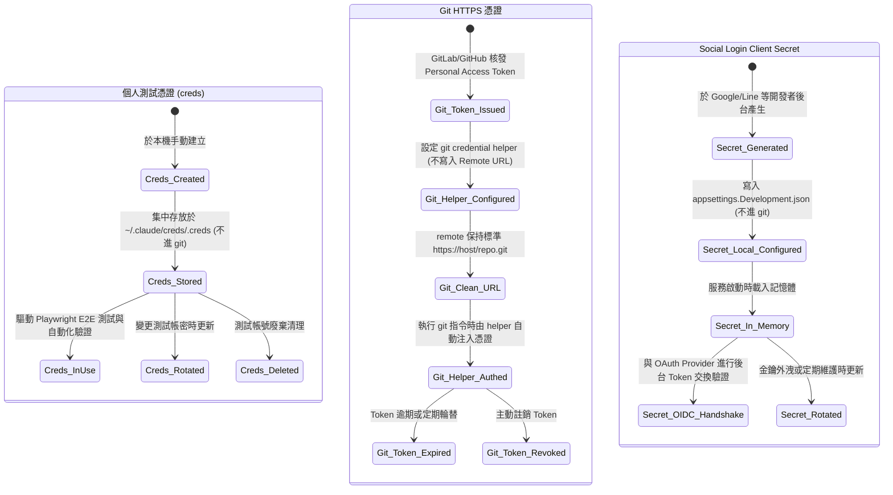
