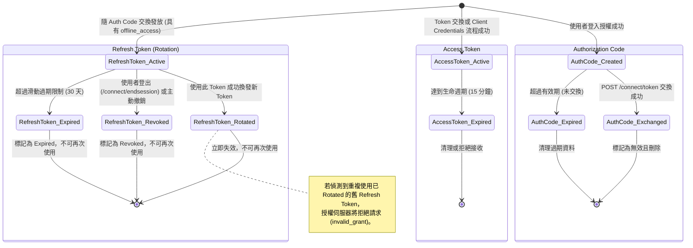
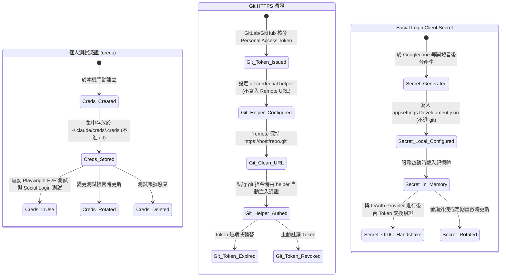

# OAuth2 + OIDC 授權流程與憑證狀態設計文件

本文件記錄了本專案中核心 OAuth2/OIDC 授權流程的循序圖，以及 OpenIddict Token 與開發環境憑證的狀態機。

---

## 1. 核心授權流程循序圖

### 1.1. Authorization Code Flow + PKCE (本地帳密登入)

```mermaid
sequenceDiagram
    autonumber
    actor User as 使用者
    participant Client as 客戶端 (SPA/MVC)
    participant AS as 授權伺服器 (AuthServer)
    database "資料庫 (Identity + OpenIddict)" as DB

    User->>Client: 點擊登入
    Note over Client: 產生 code_verifier<br/>與 code_challenge (S256)
    Client->>AS: 導向 /connect/authorize?code_challenge=...&code_challenge_method=S256
    AS->>User: 顯示登入頁面 (Authorize.cshtml)
    User->>AS: 輸入本地帳號密碼
    AS->>DB: 驗證帳密與客戶端權限
    DB-->>AS: 驗證成功
    AS-->>Client: 302 重導並回傳 Authorization Code
    Client->>AS: POST /connect/token (grant_type=authorization_code, code, code_verifier)
    AS->>AS: 驗證 code_verifier 與挑戰碼是否相符
    AS->>DB: 記錄授權與發放 Token
    DB-->>AS: 寫入成功
    AS-->>Client: 回傳 Access Token, ID Token & Refresh Token
```

### 1.2. Social Login (Google 等) 聯邦綁定與登入流程

```mermaid
sequenceDiagram
    autonumber
    actor User as 使用者
    participant Client as 客戶端 (SPA/MVC)
    participant AS as 授權伺服器 (AuthServer)
    participant Provider as 外部 Identity Provider (Google等)
    database "資料庫 (Identity)" as DB

    User->>Client: 點擊使用外部帳號登入
    Client->>AS: 導向 /connect/authorize
    AS->>User: 顯示登入頁，點擊「以 Google 繼續」
    User->>AS: 觸發 Social Login Challenge
    AS-->>Provider: 302 重導至 Provider 授權頁
    User->>Provider: 輸入憑證並授權
    Provider-->>AS: 302 重導回 /signin-google (帶有 Authorization Code)
    AS->>Provider: 交換外部 Access Token 並取得 User Profile
    Provider-->>AS: 回傳 User Profile (email, name, picture)
    AS->>DB: 查詢 AspNetUserLogins 是否已綁定此外部帳號
    alt 已綁定
        DB-->>AS: 返回對應的本地 User
    else 未綁定但 Email 已存在
        AS->>DB: 自動與現有本地帳號綁定
        DB-->>AS: 綁定成功
    else 全新使用者
        AS->>DB: 建立新 ApplicationUser + 建立外部登入綁定 (AspNetUserLogins)
        DB-->>AS: 建立成功
    end
    AS-->>Client: 302 重導並回傳 OIDC Authorization Code
    Client->>AS: POST /connect/token
    AS-->>Client: 回傳本地發放的 Token (Access, Refresh, ID Token)
```

### 1.3. Client Credentials Flow (服務對服務)

```mermaid
sequenceDiagram
    autonumber
    participant Client as API 客戶端 (WebAPI Client)
    participant AS as 授權伺服器 (AuthServer)
    database "資料庫 (OpenIddict)" as DB

    Client->>AS: POST /connect/token<br/>(grant_type=client_credentials, client_id, client_secret)
    AS->>DB: 驗證 Client ID & Client Secret
    DB-->>AS: 驗證通過
    AS->>DB: 記錄並發行 Token
    DB-->>AS: 寫入成功
    AS-->>Client: 回傳 Access Token (不含 Refresh Token)
```

---

## 2. OIDC Token 狀態機 (A 部分)

本專案基於 OpenIddict 實作，其 Token 生產與輪替的狀態流轉如下：



---

## 3. 開發與測試環境憑證狀態機 (B 部分)

為確保憑證安全性，避免 API 金鑰與個人 token 落地外洩，本專案依循 DevOps 憑證安全規範管理如下：


