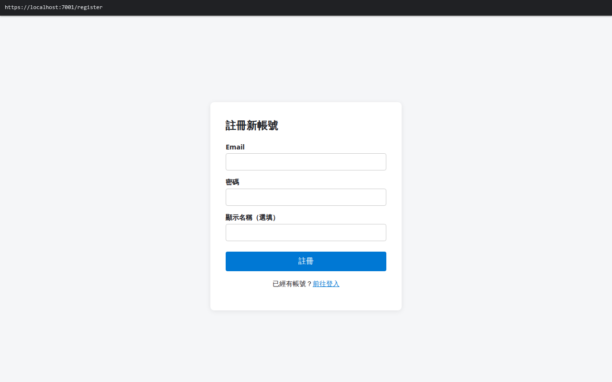
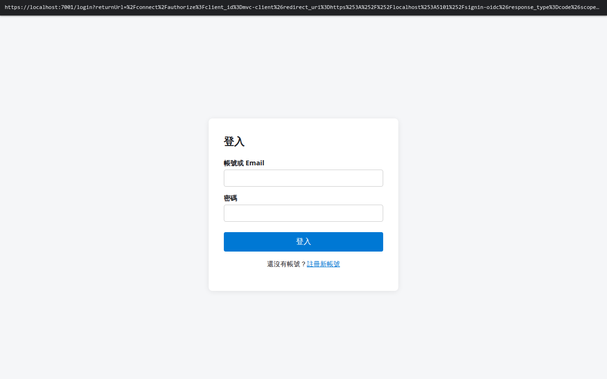

# AuthServer 核心模組使用者操作手冊

本手冊為一般使用者說明認證中心網站的各項基本操作，包含註冊新帳號、登入與登出、各類應用程式（企業網站與現代化網頁應用）登入流程，以及第三方應用授權同意頁面操作。

---

## 新會員帳號註冊指南

本指南引導您在認證系統中建立一個全新的個人會員帳號。

### 操作流程圖

[檢視操作流程圖 (HTML)](./account-registration/diagram.html)

### 畫面截圖

### 操作步驟

1. **打開註冊頁面**
   在瀏覽器上方輸入網址進入會員登入畫面，點擊登入表單下方的「註冊新帳號」文字按鈕。

2. **填寫帳號資訊**
   在畫面中的輸入框依序填入：
   - **電子信箱**：輸入您常用的 Email 信箱（例如：`user@example.com`）。
   - **設定密碼**：輸入至少 8 個字元的密碼，且必須包含英文小寫字母與數字（例如：`Password123`）。
   - **暱稱**：輸入您希望顯示的個人稱呼（例如：`王小明`）。

3. **送出註冊**
   點擊最下方的藍色「立即註冊」按鈕。畫面顯示「註冊成功」提示後，系統將自動為您轉跳至登入頁面。

### 常見狀況與排除方法

- **提示「此電子郵件已被註冊」** → 畫面上方出現紅色警示訊息 → 表示您過去已經使用該信箱建立過帳號 → 請直接回到登入頁面輸入密碼登入，或使用忘記密碼功能找回密碼。
- **提示「密碼不符合規則」** → 密碼欄位下方出現紅字警告 → 密碼長度不足 8 個字，或缺少英文數字組合 → 請修改密碼，確保長度達 8 個字元以上且同時包含英文字母與數字。
- **點擊註冊無反應** → 畫面停留在原處且送出按鈕反灰 → 可能是必填欄位有缺漏 → 請檢查電子信箱格式是否正確，並確認所有欄位皆已填寫完畢。

---

## 會員帳號登入與登出操作指南

本指南引導您如何使用註冊的帳號密碼登入系統，以及在完成操作後如何安全登出。

### 操作流程圖

[檢視操作流程圖 (HTML)](./account-login-logout/diagram.html)

### 畫面截圖

### 操作步驟

#### 登入帳號

1. **打開登入畫面**
   在瀏覽器開啟系統網址，畫面上將呈現「會員登入」表單。

2. **輸入帳號與密碼**
   - 在「帳號 / 電子信箱」欄位輸入您的註冊 Email 或帳號名稱。
   - 在「密碼」欄位輸入您的個人密碼。

3. **點擊登入按鈕**
   點擊下方的藍色「登入」按鈕。驗證成功後，畫面將自動轉跳進入系統主頁或應用程式畫面。

#### 登出帳號

1. **打開個人選單**
   在系統畫面右上角，點擊顯示您個人姓名或頭像的圖示。

2. **點擊登出按鈕**
   在展開的下拉選單中，點擊紅色的「登出」按鈕。系統將清除登入狀態並安全返回至登入頁面。

### 常見狀況與排除方法

- **提示「帳號或密碼錯誤」** → 畫面出現紅色警示訊息 → 可能是輸入的帳號或密碼有誤（注意鍵盤大小寫鎖定 Caps Lock 是否開啟） → 請重新確認並小心輸入密碼。
- **提示「嘗試次數過多，請稍後再試」** → 連續輸入錯誤密碼多次後出現鎖定訊息 → 系統為了防止惡意猜測密碼而啟動暫時保護 → 請稍候 1 分鐘後再重新嘗試登入。
- **登入後沒有跳轉頁面** → 畫面停留在登入頁但無錯誤訊息 → 瀏覽器可能封鎖了網站儲存登入憑證的權限 → 請在瀏覽器設定中確認允許本網站儲存登入資訊或清除快取後重試。

---

## 認證中心網站操作指引

本指引為您說明認證中心網站的各項畫面功能，包含會員登入、註冊新帳號、忘記密碼與雙步驟身分驗證。

### 操作流程圖

[檢視操作流程圖 (HTML)](./auth-server-webui/diagram.html)

### 操作步驟

1. **進入認證中心首頁**
   打開瀏覽器輸入系統網址，畫面中央會顯示「會員身分驗證中心」字樣與登入表單。

2. **切換註冊與登入頁面**
   - 若已有帳號：直接在登入框輸入 Email 與密碼，點擊「登入」。
   - 若為新使用者：點擊表單下方的「註冊帳號」連結，畫面將切換至註冊表單，填入信箱、設定密碼後送出。

3. **忘記密碼重設**
   若忘記密碼，點擊登入框右下角的「忘記密碼？」連結，輸入您的註冊電子信箱後點擊「發送重設信件」，並至信箱收信依指示重設密碼。

4. **完成兩步驟驗證（若已啟用）**
   若帳號開啟了安全防護，登入後畫面會提示「請輸入 6 位數驗證碼」，打開手機上的驗證器 App 輸入當前顯示的 6 碼數字後點擊「確認」。

### 常見狀況與排除方法

- **網頁顯示「連線逾時」或空白** → 網路連線異常或伺服器維護中 → 請檢查網路連線狀態，並重新整理網頁。
- **畫面提示「安全性錯誤」** → 可能使用了不合法的跳轉連結 → 請務必從官方應用程式或書籤點擊進入認證頁面。
- **兩步驟驗證碼一直提示錯誤** → 手機時間可能與標準時間有誤差 → 請在手機設定中確認「自動設定時間」已開啟。

---

## 企業應用網站登入操作手冊

本手冊引導一般使用者如何從企業內部應用網站透過統一會員系統安全登入，並瀏覽個人資料。

### 操作流程圖

[檢視操作流程圖 (HTML)](./mvc-client-auth-flow/diagram.html)

### 操作步驟

1. **進入企業網站首頁**
   在瀏覽器打開企業內部網站首頁，點擊畫面右上角的「登入」按鈕。

2. **自動導向認證頁面登入**
   畫面會自動跳轉至官方會員登入頁。在輸入框填入您的 Email 與密碼，點擊「登入」。

3. **授權確認並返回網站**
   登入成功後，系統會自動跳轉回企業網站首頁，不會發生卡住或不斷重新整理的無窮迴圈現象。

4. **檢視個人資料與權限**
   點擊右上角「個人資料」連結，頁面上會顯示「歡迎您回來！」以及您的使用者姓名、信箱與管理權限標記。

### 常見狀況與排除方法

- **登入後畫面不斷跳轉（迴圈）** → 瀏覽器跨網站隱私設定可能造成登入身分確認中斷 → 請在瀏覽器隱私設定中確認允許本網站儲存登入憑證或關閉「封鎖跨網站追蹤」。
- **個人資料頁面未顯示姓名** → 系統正在同步資料 → 請點擊瀏覽器重新整理按鈕重整頁面。
- **點擊登出後仍能看到舊畫面** → 瀏覽器快取殘留 → 請點擊重新整理確認畫面已變更為「未登入」狀態。

---

## 網頁應用程式登入操作手冊

本手冊引導一般使用者如何在現代化網頁應用程式中完成安全登入，並查看個人資料與權限資訊。

### 操作流程圖

[檢視操作流程圖 (HTML)](./spa-host-auth-flow/diagram.html)

### 操作步驟

1. **進入應用程式網站**
   打開瀏覽器進入應用網站首頁，點擊畫面導覽列上的「登入」按鈕。

2. **透過安全跳轉完成登入**
   網頁將安全導向至認證中心，輸入您的帳號密碼並點擊登入。

3. **返回應用程式網站**
   登入完成後自動跳回網站，畫面上方導覽列立即更新顯示「已登入」狀態與您的電子信箱帳號。

4. **查看詳細資料與權限表格**
   點擊「個人資料」分頁，可看到個人 Email、登入有效狀態標記以及您的身分權限列表（例如：包含 admin 角色權限）。

### 常見狀況與排除方法

- **回到首頁後仍顯示未登入** → 瀏覽器正在處理登入狀態同步 → 請稍候 1-2 秒，頁面會自動重新整理為已登入狀態。
- **切換分頁時要求重新登入** → 登入狀態逾期 → 請再次點擊登入按鈕重新進行登入。

---

## 同意授權頁面操作手冊

本手冊為您說明當第三方應用程式要求存取您的帳號資料時，如何在「同意授權」頁面上檢視要求並進行授權或拒絕。

### 操作流程圖

[檢視操作流程圖 (HTML)](./consent-page-ui/diagram.html)

### 畫面截圖

### 操作步驟

1. **檢視授權畫面資訊**
   當您在外部應用程式點擊使用會員登入後，畫面會出現「授權確認」頁面。畫面上會清楚列出：
   - **應用程式名稱**：例如「線上購物商城」或「MVC 測試應用」。
   - **要求的權限清單**：例如「查看您的個人基本資料」、「讀取您的電子郵件地址」。

2. **確認並給予授權**
   若您信任該應用程式並同意提供所需資料，點擊綠色的「同意授權」按鈕。系統將立即跳轉回該應用程式並完成登入。

3. **拒絕授權**
   若您不同意提供資料，點擊灰色的「拒絕 / 取消」按鈕。系統將跳回該應用程式並通知其未獲得授權，該程式將無法取得您的任何資料。

4. **內部信任應用（略過同意）**
   若是官方內建的信任服務，系統將自動完成授權，不會跳出同意確認畫面，直接為您登入。

### 常見狀況與排除方法

- **點擊同意後沒有跳回原應用** → 瀏覽器彈出視窗被封鎖 → 請檢查瀏覽器網址列右側是否有「已封鎖彈出視窗」圖示並選擇允許。
- **授權頁面上顯示未知的權限要求** → 該應用程式要求了額外的非必要權限 → 請仔細評估，若有疑慮請直接點擊拒絕。
