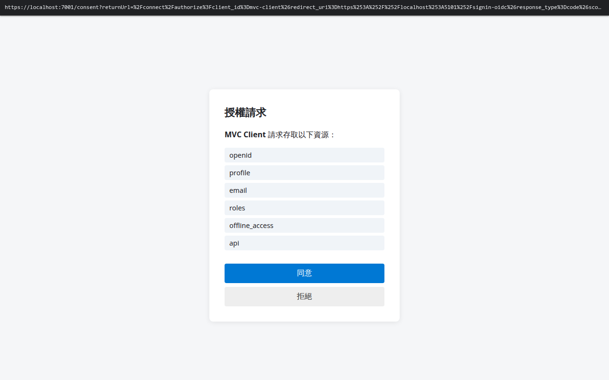
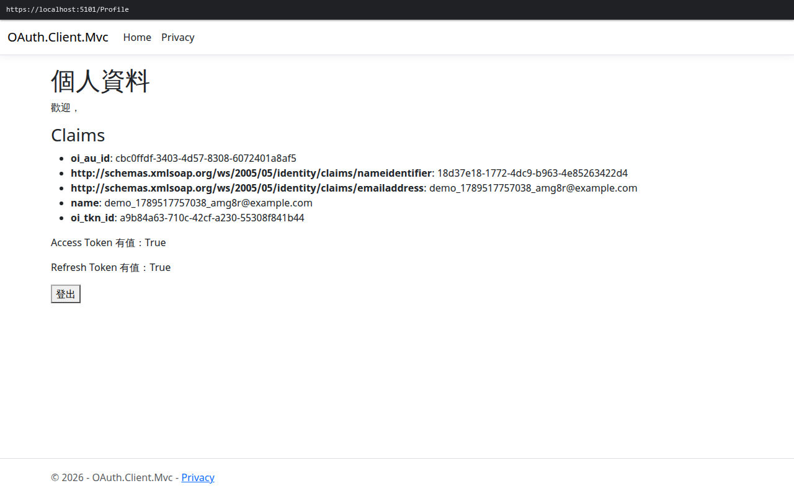

# 登入 + 同意授權操作說明（附截圖）

本文件搭配 `record-scenario.js` / `screenshot-login-consent.js` 錄製的「登入 + 同意授權」場景，
逐步說明畫面操作內容。對應影片：`output/login-consent-redo.webm`（本機保存，未進版控，
路徑：`/mnt/d/lab/oauth/tools/recording/output/login-consent-redo.webm`）。

涉及的服務網址：
- AuthServer: `https://localhost:7001`
- MVC Client（示範用第三方應用）: `https://localhost:5101`

## 場景說明

一位新會員第一次使用「MVC Client」這個第三方應用，需要先在 AuthServer 註冊帳號、登入，並在
第一次授權時同意 MVC Client 存取的權限範圍，才能完成登入並使用該應用。

## 步驟

每張截圖與影片畫面頂端都有一條黑色網址列（headless 瀏覽器沒有真實瀏覽器外框，用 `lib/url-bar.js`
注入的 overlay 顯示 `window.location.href`），直接看圖就知道當下停在哪個網址，不需要另外對照文字。

### 1. 註冊新帳號

前往 AuthServer 的 `/register` 頁面，填寫 Email 與密碼建立帳號。


### 2. 前往受保護頁面，觸發登入

存取 MVC Client 的 `/Profile` 頁面（受保護頁面），因為尚未登入，會被自動導向 AuthServer 登入頁
（網址列可見完整 `returnUrl`，帶有 OIDC `/connect/authorize` 請求參數：`client_id`、PKCE
`code_challenge`、`scope` 等）。


輸入剛剛註冊的帳密送出。

### 3. 第一次授權：同意頁面

由於這是該帳號第一次授權 MVC Client，系統會顯示同意頁面，列出 MVC Client 要求存取的權限範圍
（`openid`、`profile`、`email`、`roles`、`offline_access`、`api`）。



點擊「同意」後，系統會核發 Authorization Code 並導回 MVC Client。

### 4. 完成：回到 MVC Client 個人資料頁

MVC Client 用 Authorization Code 換得 Access Token / ID Token / Refresh Token 後，顯示已登入的
個人資料頁，含使用者 Claims 與 Token 核發狀態。



## 重新產生截圖 / 影片

服務（AuthServer 7001、MVC Client 5101、PostgreSQL 5432）需先啟動，接著：

```bash
cd tools/recording
npm install
npx playwright install chromium   # 若尚未安裝瀏覽器

# 截圖（本文件用的四張圖）
node screenshot-login-consent.js

# 錄影
node record-scenario.js --scenario login-consent
```

每次執行都會用全新的隨機測試帳號，確保一定會出現同意頁面（不會因為帳號先前已授權過而跳過）。
